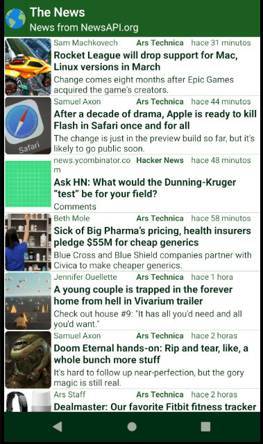
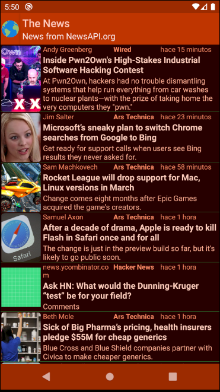
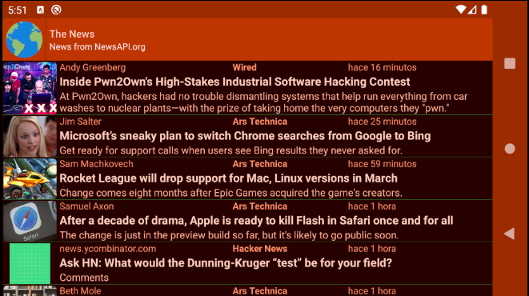

# The-News
> News App using newsApi 

## Table of contents
* [General info](#general-info)
* [Screenshots](#screenshots)
* [Features](#features)
* [Technologies](#technologies)
* [Status](#status)
* [Contact](#contact)

## General info
Project created with the purpose of learn how to create a android app, using an API (NewsApi)
and practice our codding skills.

## Screenshots

## Features
Night Mode 🌗

## Technologies
-JAVA 8 
-Gradle 

## Status
Project is: _in progress_.

## Contact
Created by [@edoxazul](https://github.com/edoxazul) - feel free to contact me!
